# IrysBase User Flows

## Overview
This document describes the complete user journey through the IrysBase platform, from initial connection to advanced features.

---

## 1. Authentication Flow

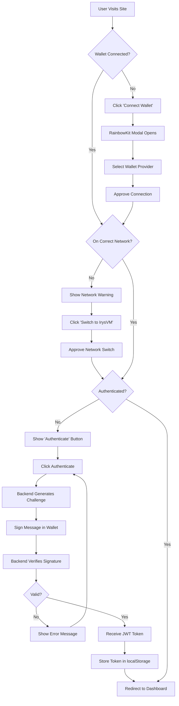

### Authentication Steps:
1. **Wallet Connection**: User connects wallet via RainbowKit
2. **Network Check**: Verify user is on IrysVM (Chain ID: 1270)
3. **Challenge Generation**: Backend creates unique challenge string
4. **Signature Request**: User signs message with wallet
5. **JWT Issuance**: Backend verifies signature and issues 7-day JWT
6. **Session Start**: Token stored, user authenticated

---

## 2. Project Management Flow

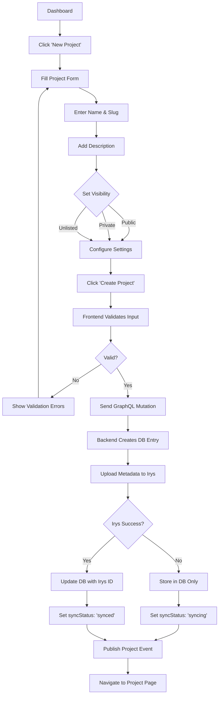

### Project Creation Steps:
1. **Form Input**: Name, slug, description, visibility
2. **Validation**: Check slug uniqueness, required fields
3. **Database**: Create project record with owner
4. **Irys Upload**: Store project metadata permanently
5. **Event**: Publish PROJECT_UPDATED subscription event
6. **Navigation**: Redirect to new project page

---

## 3. Document Creation & Editing Flow

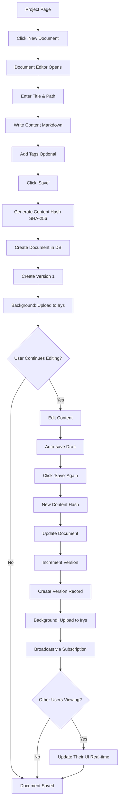

### Document Operations:
- **Create**: Title, path, content → DB + Irys
- **Update**: New version created automatically
- **Version Control**: Every save = new version with diff
- **Real-time Sync**: WebSocket broadcasts changes
- **Permanent Storage**: Irys background upload with proof

---

## 4. Search & Discovery Flow

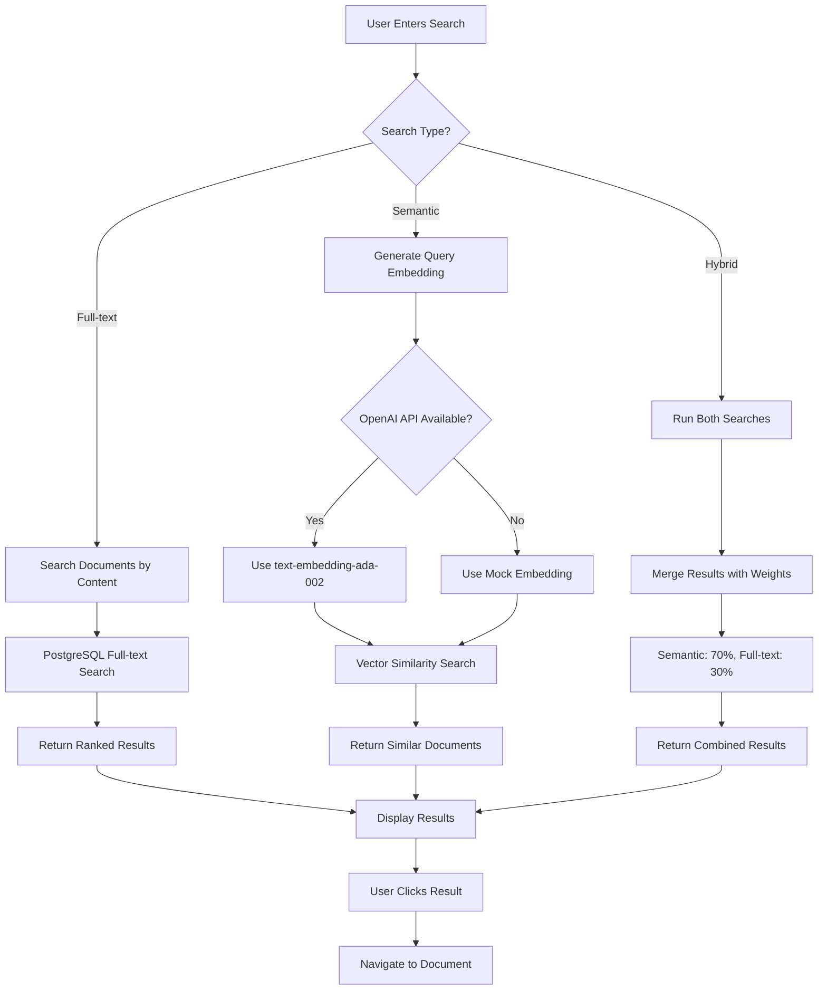

### Search Features:
- **Full-text**: Traditional keyword search
- **Semantic**: AI-powered meaning-based search
- **Hybrid**: Best of both worlds
- **Filters**: By project, date, author
- **Highlights**: Matched terms highlighted

---

## 5. Collaboration Flow

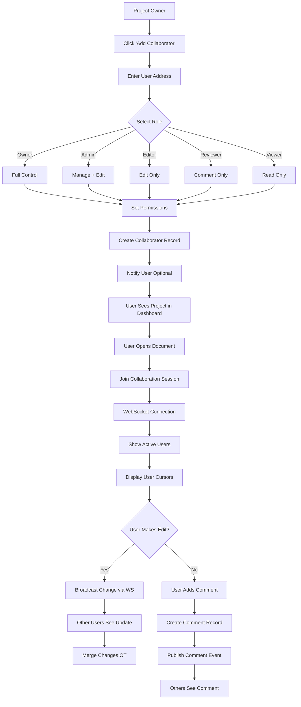

### Collaboration Features:
- **Roles**: Owner, Admin, Editor, Reviewer, Viewer
- **Real-time**: WebSocket-based live editing
- **Presence**: See who's online and their cursor
- **Comments**: Inline threaded discussions
- **Permissions**: Granular access control

---

## 6. Storage & Usage Tracking Flow

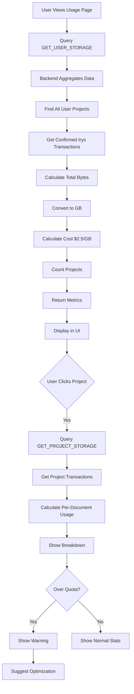

### Storage Metrics:
- **User-level**: Total across all projects
- **Project-level**: Per-project breakdown
- **Document-level**: Individual file sizes
- **Cost Calculation**: Real Irys transaction data
- **Sync Status**: Track upload completion

---

## 7. Programmable Data Flow

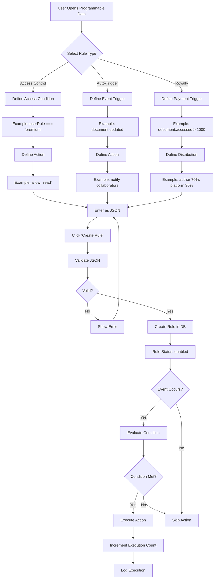

### Programmable Data Types:
1. **Access Control**: Who can read/write data
2. **Auto-Triggers**: Automated workflows on events
3. **Royalty Distribution**: Automatic payments

---

## 8. AI-Powered Features Flow

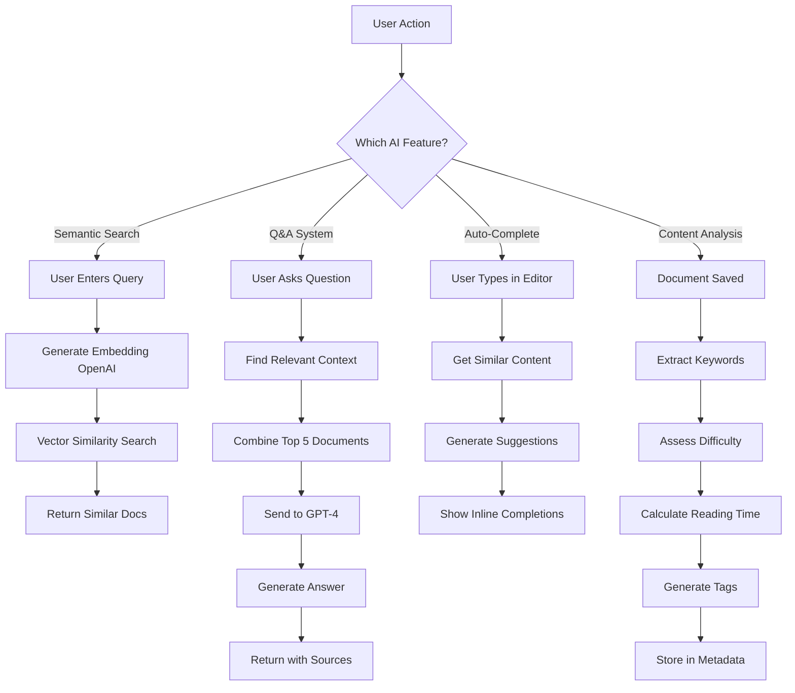

### AI Features:
- **Semantic Search**: Meaning-based document discovery
- **Q&A**: Answer questions from document corpus
- **Auto-complete**: Smart content suggestions
- **Analysis**: Automatic tagging and categorization
- **Embeddings**: OpenAI ada-002 model

---

## 9. Version Control & History Flow

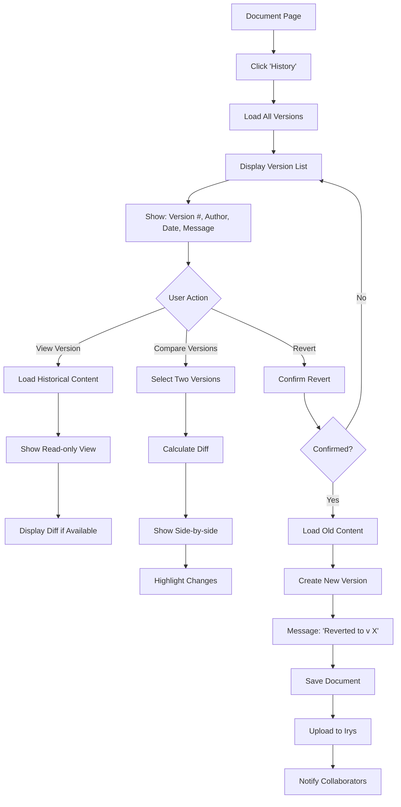

### Version Control:
- **Automatic**: Every save creates new version
- **Git-like**: Version numbers, commit messages
- **Diff View**: See what changed
- **Revert**: Restore previous versions
- **Audit Trail**: Complete history with authors

---

## 10. Error Handling & Recovery Flow

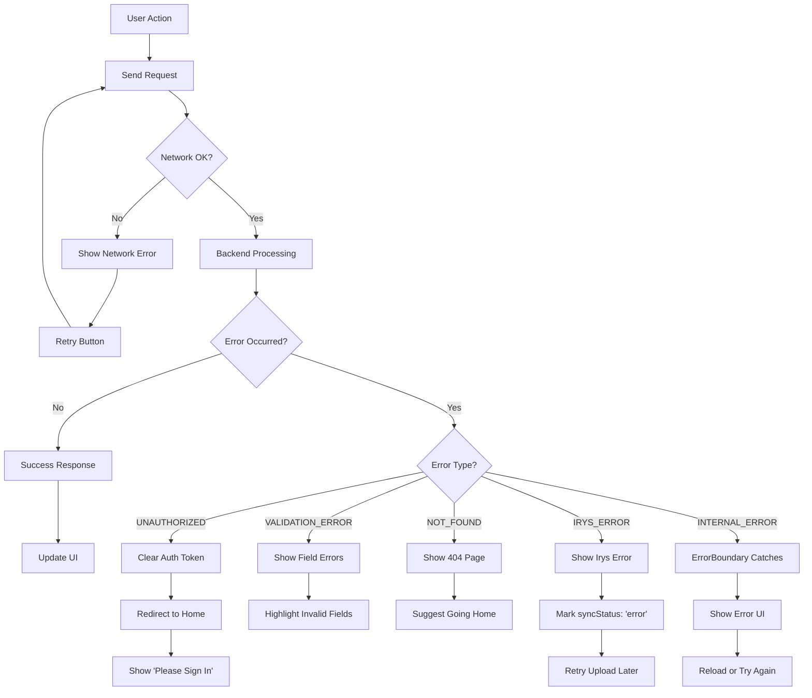

### Error Types:
- **Network**: Connection issues
- **Authentication**: Invalid/expired tokens
- **Validation**: Bad user input
- **Not Found**: Missing resources
- **Irys**: Storage service errors
- **Internal**: Unexpected server errors

---

## 11. Complete User Journey Example

**Scenario**: Alice creates a documentation project with Bob as collaborator

```mermaid
flowchart TD
    A[Alice Visits IrysBase] --> B[Connects MetaMask]
    B --> C[Switches to IrysVM]
    C --> D[Signs Authentication]
    D --> E[JWT Received & Stored]
    E --> F[Dashboard Loads]

    F --> G[Clicks 'New Project']
    G --> H[Enters: 'API Docs', 'api-docs']
    H --> I[Sets Public, Clicks Create]
    I --> J[Project Created in DB]
    J --> K[Metadata Uploaded to Irys]
    K --> L[Project Page Opens]

    L --> M[Clicks 'New Document']
    M --> N[Enters: 'Getting Started']
    N --> O[Writes Markdown Content]
    O --> P[Adds tags: tutorial, beginner]
    P --> Q[Clicks Save]
    Q --> R[Document Saved + Irys Upload]

    R --> S[Clicks 'Add Collaborator']
    S --> T[Enters Bob's Address]
    T --> U[Sets Role: Editor]
    U --> V[Bob Added]

    V --> W[Bob Opens Project]
    W --> X[Bob Opens Document]
    X --> Y[WebSocket Connects]
    Y --> Z[Alice & Bob See Each Other]

    Z --> AA[Bob Edits Line 5]
    AA --> AB[Change Broadcasts to Alice]
    AB --> AC[Alice Sees Bob's Cursor]
    AC --> AD[Bob Saves]
    AD --> AE[Version 2 Created]
    AE --> AF[Both Users Updated]

    AF --> AG[Alice Clicks History]
    AG --> AH[Sees v1 by Alice, v2 by Bob]
    AH --> AI[Compares Versions]
    AI --> AJ[Views Diff]

    AJ --> AK[Alice Views Usage Page]
    AK --> AL[Sees: 0.0001 GB, $0.00]
    AL --> AM[Clicks Storage Details]
    AM --> AN[Sees Document Breakdown]
```

---

## Summary

The IrysBase platform provides a complete workflow for:

1. **Authentication**: Secure wallet-based login with JWT
2. **Project Management**: Create, organize, collaborate
3. **Document Editing**: Real-time collaborative markdown editor
4. **Version Control**: Git-like history with full audit trail
5. **Search**: AI-powered semantic and full-text search
6. **Storage**: Permanent Irys storage with usage tracking
7. **Programmable Data**: Rules for access, triggers, royalties
8. **AI Features**: Smart search, Q&A, auto-complete
9. **Collaboration**: Real-time editing with presence awareness
10. **Error Handling**: Graceful degradation and recovery

Each flow is designed to be intuitive, with clear feedback and error handling at every step.
